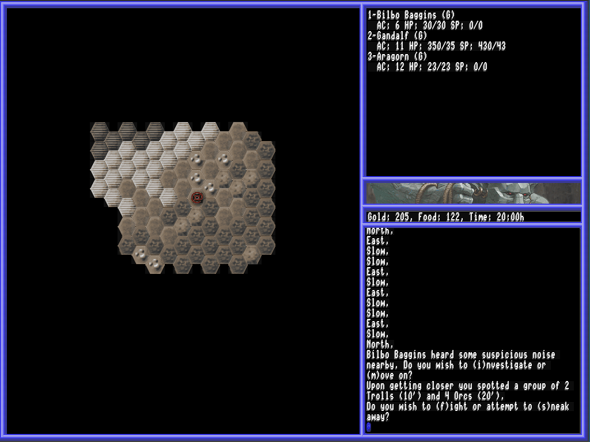
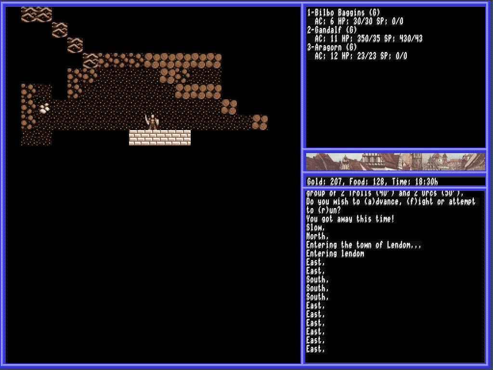
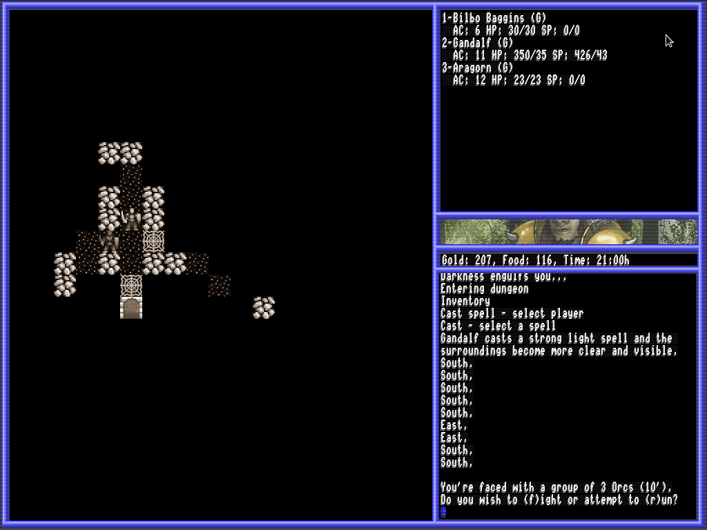
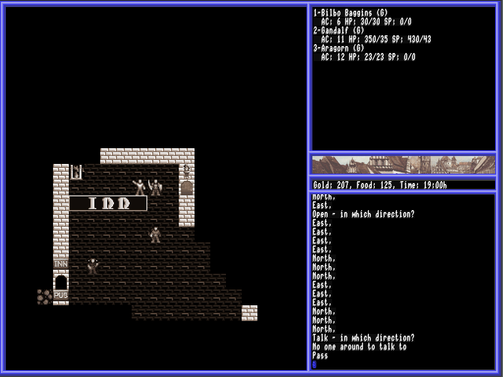

# Eureka - party like it's 1985!
Eureka is an old-school computer roleplaying-game (CRPG) engine as well as work
in progress and has been for almost 10 years - on and off.  It comes with one
demo game that can already be played.

## Disclaimer
I am of the opinion that CRPGs in the truest sense of the word have more or
less disappeared after the late 1980s.  What followed then was a wave of
action adventures, wrongly labelled as CRPGs, that lacked depth and traded
immersive game play for hollywood-like graphics and sound effects, and
complex, multi-dimensional models of a gaming world for some boring, linear
story telling.  And don't get me started on online multiplayer...

So, no, I won't update the graphics (much), and what you see below is not a
bug.  It is, what you get.  If you don't like that, do us both a favour and
get back to your Playstation before you contact me about it.

However, if at this point, you're still reading, then perhaps you will find
Eureka's approach appealing to you.

## Installation and starting
Right now, there is no release. You can pull the C++ sources from here, and
call autogen.sh to create a configure script and Makefile for you.  You will
need to have SDL2, Boost >= 1.58, GTKMM-3.x, libxml++2.6 and Lua5.1 installed
in order to build it.

After you did a 'make install', you can play the demo game by invoking

    eureka Demoworld

on your terminal, where Demoworld is simply the name of the demo game.

Beware of bugs though!

## Screenshots

Exploring the vast outdoors landscapes

Wandering around a town

Engaged in a battle in some dark, deep dungeon

Conversations with town folks

## Copyright

Eureka is copyrighted by Andreas Bauer, baueran@gmail.com.

It is free of charge and released under the terms of the GPL 3.

Sources for additional multimedia files, used for the demo game that comes with it, 
are attributed in data/COPYRIGHT.
